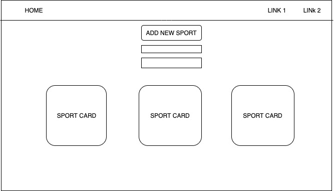
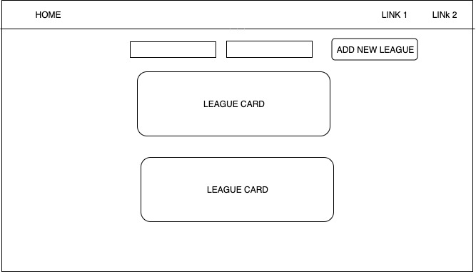
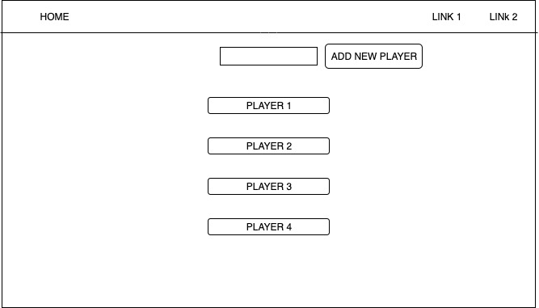

# General Assembly SEI July 29th - Project 3

* [Deployed App](https://indiepk.herokuapp.com/)
* [Project Board](https://github.com/dipoosinubi/FantasyDB/projects/1)

## Overview

The goal of this project was to create a full stack application using the MERN Stack that would allow users to recieve messages in realtime. Created a fully functional chat application using React.js, Express, MongoDB, Mongoose, Node.js and Socket.io. The most challenging part of this project was integrating socket.io into a fullstack mern application because there was a lack of examples using socket.io in a mern application. The solution I came up with arose from my understanding of… https://chatter-project.herokuapp.com/

## Technologies Used:
* Express
* MongoDB
* Mongoose 
* NodeJs
* JavaScript
* ReactJS
* React Bootstrap
* CSS

## Version 2 Goals:
* Apply full CRUD to all 3 Models
* Add chat functionality to individal leagues
* Adjust app for a friendlier mobile view
* Implement some kind of image/file upload system

## ERD

## Wireframes

